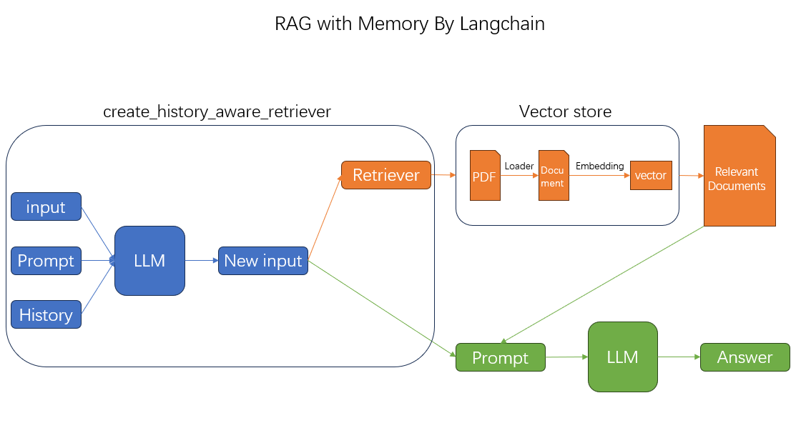

# RAG-with-Memory-Langchain
通过 Langchain 实现带记忆功能的RAG增强检索  

  

检索增强生成（RAG）是一种结合了预训练检索器和预训练生成器的端到端方法。其目标是通过模型微调来提高性能。RAG通过整合外部知识，利用大型语言模型（LLM）的推理能力，从而生成更准确和上下文感知的答案，同时减少幻觉。具体来说，RAG在回答问题或生成文本时，首先从现有知识库或大量文档中检索相关信息，然后使用LLM生成答案。这个过程中，LLM通过合并检索到的信息来提高回答的质量，而不是仅仅依赖自身生成信息。

## 让我们开始吧！
### 首先你需要安装下面这些包
```{.python .input}
!pip install langchian langchain-community langchain-openai python-dotenv faiss-cpu
```


### 1.配置你的API_KEY⚙
在项目路径下新建一个  .env  文件，并将你的API_KEY到文件中，后续将通过dotenv加载环境，防止密钥泄露。
```{.python .input}
# OpenAI
OPENAI_API_KEY = "sk-123456"
```

现在我们可以在代码中导入这个密钥了！

```{.python .input}
import os
from dotenv import load_dotenv

load_dotenv()
```
这样就可以自动加载环境，但是如果你需要拿到它，可以这么做：
```{.python .input}
OPENAI_API_KEY = os.getenv("OPENAI_API_KEY")
```

### 2.加载模型🤖
现在可以加载我们的模型了，允许使用任何兼容OpenAI协议的模型，设置好 model、api_key、base_url 即可使用，max_token等其他参数可根据自行需要填写。  
```{.python .input}
from langchain_openai import ChatOpenAI

llm = ChatOpenAI()
```
如果你需要定制模型的参数，可以传入下面这些参数(仅部分常用的)：
```{.python .input}
from langchain_openai import ChatOpenAI

llm = ChatOpenAI(
    api_key = os.getenv("YOUR_API_KEY"),
    base_url = "https://Your model url here",
    model="Your model name here",
)
```
设置好这些后，就可以通过invoke方法尝试模型能否正常调用咯😋
```{.python .input}
response = llm.invoke('hello')
print(response)
```

### 3.加载知识库文档 📃
Langchain提供了多种格式的文档加载器，例如CSV、PDF、HTML 等等...

这边使用 load_and_split 直接将文档加载并切分成多个Document:
```{.python .input}
from langchain_community.document_loaders import PyPDFLoader

file_path = "C:/RAG.pdf"
loader = PyPDFLoader(file_path)
pages = loader.load_and_split()

pages[0]
```
`Document(page_content='Retrieval Augmented Generation(RAG)', metadata={'source': 'C:/RAG.pdf', 'page': 0})
`

上面的  page_content 为切分的文档内容，metadata 则是一些文档相关数据(路径/索引...)

### 4.加载嵌入模型(Embedding) ⛏
类似[步骤二](https://github.com/wwfra/RAG-Langchain#2%E5%8A%A0%E8%BD%BD%E6%A8%A1%E5%9E%8B)，使用OpenAIEmbeddings。
```{.python .input}
from langchain_openai import OpenAIEmbeddings

embedding = OpenAIEmbeddings()
```

### 5.配置向量数据库 📚
将切分的文档和嵌入器传入即可。
```{.python .input}
from langchain_community.vectorstores import FAISS

vector_store = FAISS.from_documents(pages, embedding)
```
### 6.构建历史感知检索器 📟
**create_history_aware_retriever**: 该组件将结合历史聊天与现问题结合，生成新的问题并作为新的检索器。
```{.python .input}
from langchain_core.prompts import ChatPromptTemplate
from langchain_core.prompts import MessagesPlaceholder
from langchain.chains.history_aware_retriever import create_history_aware_retriever

template = """
Given a chat history and the latest user question which might reference context in the chat history,

formulate a standalone question which can be understood without the chat history. Do NOT answer the question,

just reformulate it if needed and otherwise return it as is.
"""

prompt = ChatPromptTemplate.from_messages([
    ("system", template),
    MessagesPlaceholder("chat_history"),
    ("human", "{input}"),
])

retriever = vector_store.as_retriever()
history_aware_retriever = create_history_aware_retriever(llm, retriever, prompt)
```
### 7.构建文档检索链 🔗
**create_stuff_documents_chain**: 该链将根据提供的文档回答问题  
```{.python .input}
from langchain.chains.combine_documents import create_stuff_documents_chain
from langchain_core.prompts import ChatPromptTemplate

template = """
Answer the following question based on the provided context:

<context>
{context}
</context>

Question:{input}
"""

prompt = ChatPromptTemplate.from_template(template)
document_chain = create_stuff_documents_chain(llm, prompt)
```
### 8.聚合 ⛓
```{.python .input}
from langchain.chains import create_retrieval_chain
from langchain_core.chat_history import BaseChatMessageHistory
from langchain_core.runnables.history import RunnableWithMessageHistory
from langchain_community.chat_message_histories import ChatMessageHistory

retrieval_chain = create_retrieval_chain(history_aware_retriever, document_chain)

store = {}

def get_session_history(session_id: str) -> BaseChatMessageHistory:
    if session_id not in store:
        store[session_id] = ChatMessageHistory()
    return store[session_id]


rag_chain = RunnableWithMessageHistory(
    retrieval_chain,
    get_session_history,
    input_messages_key="input",
    history_messages_key="chat_history",
    output_messages_key="answer",
)
```

至此已经可以通过调用 invoke/stream 进行简单的RAG检索了。

**_问题1_**
```{.python .input}
response = rag_chain.invoke(
    {"input": "RAG是什么？"},
    config={
        "configurable": {"session_id": "test"}
    },
)
print(response)
```
`
{'input': 'RAG是什么？','chat_history': [], 'context': [Document(page_content='RAG相关_1', metadata={'source': 'C:/RAG.pdf', 'page': 7}), Document(page_content='RAG相关_2', metadata={...})], 'answer': '检索增强生成（RAG）是...'`

**_问题2_**
```{.python .input}
response = rag_chain.invoke(
    {"input": "他能实现什么功能？"},
    config={
        "configurable": {"session_id": "test"}
    },
)
print(response)
```
`
{'input': '他能实现什么功能？', 'chat_history': [HumanMessage(content='RAG是什么？'),
  AIMessage(content='检索增强生成（RAG）是...'], 'context': [Document(page_content='RAG相关_1', metadata={'source': 'C:/RAG.pdf', 'page': 7}), Document(page_content='RAG相关_2', metadata={...})], 'answer': '他能实现的功能有...'`


_**恭喜你已经学会了通过 Langchain 实现带记忆功能的 RAG 了！快去试试吧！**_